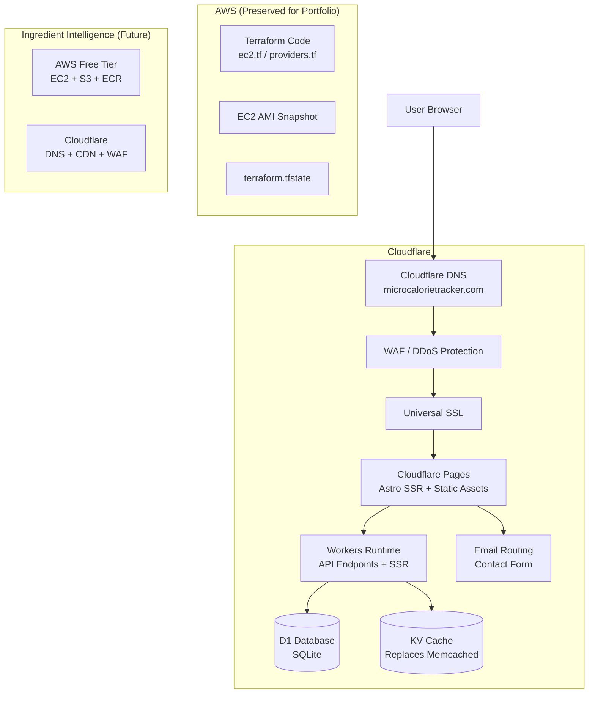

# Architecture & Migration Plan

---

## Section 1: Current Architecture Analysis

### MicroCalorieTracker — Current Stack

```
Internet
  │
  ▼
  Cloudflare DNS (microcalorietracker.com)
  │
  ▼
  AWS EC2 (t2.micro, us-east-1)
  ├── Nginx (reverse proxy, SSL via Let's Encrypt)
  └── Docker Compose
      ├── Astro App (Node.js 22, SSR via @astrojs/node)
      ├── MySQL 8 (persisted on 5GB EBS volume)
      ├── Memcached (alpine, in-memory cache)
      └── Watchtower (auto-deploy on Docker Hub push)
```

### What the App Actually Does

| Component | Reality |
|-----------|---------|
| **"AI" Analysis** | Hardcoded lookup of ~35 dishes with keyword matching. No ML/AI. |
| **Database** | MySQL 8 with 7 tables (users, profiles, sessions, guest_sessions, meal_entries, daily_summaries, contacts) |
| **Auth** | Passwordless email login — 64-char hex session token in cookie |
| **Cache** | Memcached for profile & user lookups, 1-hour TTL |
| **File Uploads** | Images accepted but **never stored or processed** — discarded |
| **Frontend** | Astro SSR (server-side rendered, not static) |
| **Analytics** | Google Analytics G-Z2WGLYYM60 |
| **Deployment** | Docker Hub → Watchtower auto-pull on EC2 |

### Cost Breakdown (Current)

| Service | Monthly Cost |
|---------|-------------|
| EC2 t2.micro (750 hrs free) | $0 (within free tier) |
| EBS 5GB gp3 | ~$0.50 |
| EBS 15GB root | ~$1.50 |
| Elastic IP | $0 (if attached) |
| Docker Hub (1 private repo) | $0 |
| Cloudflare DNS | $0 |
| **Total** | **~$2/month** after free tier exhaustion |

After 12 months (when free tier expires): EC2 t2.micro = ~$8.50/mo + EBS ~$2/mo = **~$10.50/month**.

---

## Section 2: Recommended Final Architecture

### Decision: **Move MicroCalorieTracker 100% to Cloudflare**

The app is a perfect candidate:
- **Lightweight SSR** with minimal processing
- **No actual ML/AI** — just keyword lookups
- **No file storage** — images discarded
- **Simple relational data** — 7 small tables
- **Low traffic** — personal portfolio project

```
┌─────────────────────────────────────────────────────────────────────┐
│                      CLOUDFLARE                                     │
│                                                                     │
│  ┌──────────────┐    ┌──────────────────┐    ┌───────────────────┐ │
│  │  Cloudflare   │───▶│  Cloudflare       │    │  Cloudflare       │ │
│  │  DNS          │    │  WAF / DDoS       │    │  SSL (Universal)  │ │
│  └──────────────┘    └──────────────────┘    └───────────────────┘ │
│         │                                                           │
│         ▼                                                           │
│  ┌─────────────────────────────────────────────┐                    │
│  │  Cloudflare Pages + Workers (Astro SSR)     │                    │
│  │  ┌─────────────────┐  ┌──────────────────┐  │                    │
│  │  │ Static Assets    │  │ Worker Runtime   │  │                    │
│  │  │ (images, CSS,    │  │ (API endpoints,  │  │                    │
│  │  │  JS bundles)     │  │  SSR pages)      │  │                    │
│  │  └─────────────────┘  └──────────────────┘  │                    │
│  └─────────────────────────────────────────────┘                    │
│         │                    │                                       │
│         ▼                    ▼                                       │
│  ┌──────────┐    ┌──────────────────┐    ┌───────────────────┐      │
│  │ D1 DB     │    │ KV (Cache)       │    │ Workers AI        │      │
│  │ (SQLite)  │    │ replaces         │    │ (future: actual   │      │
│  │ replaces  │    │ Memcached        │    │  AI/ML, not now)  │      │
│  │ MySQL     │    └──────────────────┘    └───────────────────┘      │
│  └──────────┘                                                       │
│                                                                     │
│  ┌──────────────────────────────────────────────────────────────┐   │
│  │ Email Routing / Workers (contact form → email)               │   │
│  └──────────────────────────────────────────────────────────────┘   │
└─────────────────────────────────────────────────────────────────────┘
                              │
                              ▼
               ┌──────────────────────────────┐
               │  AWS (frozen / portfolio)     │
               │                               │
               │  Terraform code preserved     │
               │  EC2 snapshot available       │
               │  Used for Ingredient Intel    │
               └──────────────────────────────┘
```

### Ingredient Intelligence — Design Principles

Reserve the existing AWS knowledge for this project. Design it to:
- Stay within free tier where possible
- Use Terraform for all infrastructure
- Use Docker + Linux + Nginx
- Use Cloudflare as CDN/WAF layer
- Use actual AI/ML via external APIs or Workers AI

```
┌──────────────┐     ┌──────────────┐
│  Cloudflare   │     │  AWS Free    │
│  DNS + CDN    │     │  Tier        │
│  WAF + SSL    │     │              │
├──────────────┤     ├──────────────┤
│ Pages/Workers│     │ EC2 t2.micro │
│ (frontend    │     │ (Docker:     │
│  UI)         │     │  App + Nginx │
│              │     │  + DB)       │
│ D1 or KV     │     │              │
│ (cache)      │     │ S3 (images)  │
└──────────────┘     └──────────────┘
```

---

## Section 3: Cloudflare Services to Use

### For MicroCalorieTracker (Full Migration)

| Service | Purpose | Free Tier | Replacement For |
|---------|---------|-----------|-----------------|
| **Cloudflare Pages** | Host Astro SSR app (switch adapter to `@astrojs/cloudflare`) | 500 builds/mo, 1 request/10s | EC2 + Nginx |
| **Cloudflare Workers** | Server-side rendering + API endpoints (bundled with Pages) | 100k req/day | Node.js server |
| **D1** | Relational database — SQLite dialect | 5GB storage, 5M rows/mo | MySQL 8 |
| **KV** | Cache for user/profile lookups | 1GB storage, 1M reads/day | Memcached |
| **Workers AI** | Future AI features (not needed now) | 10k neurons/day | N/A |
| **Email Routing** | Forward contact form to your email | Free | N/A (or SES) |
| **Cloudflare DNS** | DNS management | Free | Already using |
| **Universal SSL** | Auto SSL certificates | Free | Let's Encrypt |

### Database Migration: MySQL → D1 (SQLite)

The 7 MySQL tables map cleanly to D1:

| MySQL | D1 (SQLite) | Notes |
|-------|-------------|-------|
| `users` | `users` | Same schema |
| `profiles` | `profiles` | Same schema |
| `sessions` | `sessions` | Same schema |
| `guest_sessions` | `guest_sessions` | Same schema |
| `meal_entries` | `meal_entries` | Remove `JSON` type → `TEXT` |
| `daily_summaries` | `daily_summaries` | Remove `JSON` type → `TEXT` |
| `contacts` | `contacts` | Same schema |

**Key changes needed:**
- Replace `mysql2/promise` with `@cloudflare/d1` (or D1 binding API)
- Replace `mysql.execute()` with `db.prepare().run()/all()`
- Replace `ON DUPLICATE KEY UPDATE` with `INSERT OR REPLACE` or `ON CONFLICT`
- Replace `CURDATE() - INTERVAL ? DAY` with `date('now', '-? days')`
- Replace `CURRENT_TIMESTAMP` with `datetime('now')`
- Remove auto-increment syntax nuance (SQLite auto-increment is implicit on INTEGER PRIMARY KEY)

### Cache Migration: Memcached → KV

Replace `memjs` calls with `caches.default` or Workers KV:
- `cacheGet(key)` → `env.KV.get(key, 'json')`
- `cacheSet(key, val)` → `env.KV.put(key, JSON.stringify(val), {expirationTtl: CACHE_TTL})`
- `cacheDel(key)` → `env.KV.delete(key)`

### Code Changes Required

| File | Change |
|------|--------|
| `astro.config.mjs` | Switch `@astrojs/node` → `@astrojs/cloudflare` |
| `package.json` | Remove `mysql2`, `memjs`; add `@astrojs/cloudflare`, `@cloudflare/d1` |
| `src/lib/db.ts` | Rewrite all queries for D1 (SQLite dialect) |
| `src/lib/cache.ts` | Rewrite to use KV binding |
| `src/lib/auth.ts` | Move `crypto.randomBytes` to `crypto.getRandomValues` (Web Crypto) |
| All `.astro` pages | May need minor adjustments for Workers runtime (no Node.js globals) |
| `Dockerfile` | No longer needed (deleted) |
| `docker-compose.yml` | No longer needed (deleted) |
| `deploy.sh` | Replace with `wrangler deploy` |

### Files That Stay the Same
- `src/styles/global.css` — no changes needed
- `src/components/Navbar.astro` — no changes needed
- `src/layouts/Layout.astro` — no changes needed
- `src/pages/index.astro` (and other page templates) — likely unchanged
- `src/lib/nutrition.ts` — pure functions, no runtime deps
- `src/pages/api/analyze.ts` — some imports change, logic stays
- `src/pages/api/*.ts` — import changes, query rewrites, logic stays

---

## Section 4: AWS Services to Use

### Preserve for Portfolio
- **Terraform code** (`micro/Terraform/`) — freeze in repo as evidence
- Take a final **AMI snapshot** of the EC2 instance before migration
- **Preserve `terraform.tfstate`** in git as proof of infrastructure

### For Ingredient Intelligence (Future Project)
Keep EC2 knowledge alive. Potential design:

| AWS Service | Use Case | Free Tier |
|-------------|----------|-----------|
| **EC2 t2.micro** | Docker host for backend services | 750 hrs/mo (12 months) |
| **ECR** | Private Docker registry | 500MB free |
| **S3** | Image/file storage for OCR | 5GB free |
| **RDS (or keep MySQL on EC2)** | Database | RDS db.t2.micro free (12mo) or skip and self-host |
| **CloudFront** | CDN (or use Cloudflare instead) | 1TB free (12mo) |
| **SES** | Email sending | 62k emails/mo |
| **Bedrock** | Actual AI/ML (Claude, etc.) | Pay-per-use |

### Recommendation: Don't Run Both Projects on AWS Simultaneously

- MicroCalorieTracker moves to Cloudflare ($0/mo forever)
- Stop the EC2 instance (snapshot first for portfolio)
- Ingredient Intelligence can use the freed-up free tier EC2 hours if needed

---

## Section 5: Cost Optimization Strategy

| Item | Current | After Migration | Savings |
|------|---------|-----------------|---------|
| EC2 t2.micro | $8.50/mo (post-free-tier) | $0 | **$102/yr** |
| EBS (5+15 GB) | ~$2/mo | $0 (snapshot only) | **$24/yr** |
| MySQL Operations | Self-managed (maintenance) | $0 (D1 managed) | **Time** |
| Let's Encrypt renewal | Cron job maintenance | $0 (Cloudflare SSL) | **Time** |
| Docker Hub | Free tier | Not needed | $0 |
| Cloudflare Pages | $0 | $0 | Same |
| Cloudflare D1 | $0 | $0 (5GB free) | Same |
| Cloudflare KV | $0 | $0 (1GB free) | Same |
| **Total** | **~$10.50/mo** | **$0/mo** | **$126/yr** |

### Free Tier Limits & Expected Usage

| Service | Free Limit | Expected Usage | Headroom |
|---------|-----------|----------------|----------|
| Workers | 100k req/day | ~500 req/day (personal app) | **200x** |
| D1 | 5GB storage, 5M rows/mo | ~5MB, ~1000 rows/mo | **Massive** |
| KV | 1GB, 1M reads/day | ~1MB, ~100 reads/day | **Massive** |
| Pages | 500 builds/mo | ~10 builds/mo | **50x** |
| Workers AI | 10k neurons/day | Not using yet | N/A |

---

## Section 6: Portfolio Value Analysis

### Skills Demonstrated (Before Migration — Already in Portfolio)

| Skill | Evidence | Recruiter Value |
|-------|----------|-----------------|
| **Terraform** | `ec2.tf`, `providers.tf`, `outputs.tf`, `terraform.tfstate` | **High** — IaC is essential |
| **Docker** | `Dockerfile`, `docker-compose.yml`, multi-container setup | **High** — containerization |
| **Linux Admin** | `setup.sh` (361 lines): Nginx, certbot, systemd, fstab, EBS | **High** — server management |
| **Nginx** | Reverse proxy, SSL termination, HTTP→HTTPS redirect | **Medium** — web server config |
| **AWS EC2** | Instance, security group, EBS, key pairs | **High** — cloud fundamentals |
| **CI/CD** | `deploy.sh`: build → push → terraform → verify | **High** — automation pipeline |
| **Astro/Node.js** | Full-stack SSR application | **Medium** |
| **MySQL** | Database schema, connection pooling, CRUD | **Medium** |

### Skills Demonstrated (After Migration — Added Value)

| Skill | Evidence | Recruiter Value |
|-------|----------|-----------------|
| **Cloudflare Workers** | Serverless migration from Node.js | **Very High** — edge computing trend |
| **Cloudflare D1** | Relational DB on serverless | **High** — new tech, rising demand |
| **Cloudflare KV** | Distributed caching | **Medium** |
| **Migration Strategy** | Planned architecture change | **Very High** — modernization skills |
| **Cost Optimization** | Reduced $126/yr → $0 | **High** — FinOps mindset |
| **Full-Stack Serverless** | Entire app on edge | **Very High** — modern architecture |

### Dual Skillset: Cloudflare + AWS = Top Candidate

Being proficient in **both** AWS and Cloudflare makes you more valuable than someone specialized in just one. The migration demonstrates you can:
1. Architect on traditional cloud (AWS)
2. Modernize to serverless/edge (Cloudflare)
3. Evaluate trade-offs objectively
4. Execute migrations safely

---

## Section 7: Migration Plan

### Phase 0: Preparation (1-2 hours)

```
[ ] Take EC2 AMI snapshot (final backup)
[ ] Export MySQL data to SQL dump
[ ] Preserve terraform.tfstate in git
[ ] Push all current code to git (clean state)
[ ] Add wrangler.jsonc to project
[ ] Create D1 database: wrangler d1 create micros-db
```

### Phase 1: Code Migration (2-4 hours)

```
[ ] Install @astrojs/cloudflare adapter
[ ] Remove @astrojs/node adapter
[ ] Update astro.config.mjs
[ ] Rewrite db.ts → d1 client
[ ] Rewrite cache.ts → KV client
[ ] Update auth.ts → Web Crypto API
[ ] Test all 13 API endpoints
[ ] Test all pages SSR on Workers
[ ] Remove mysql2 and memjs from package.json
```

### Phase 2: Data Migration (1 hour)

```
[ ] Import SQL dump into D1:
     wrangler d1 execute micros-db --file=micros-dump.sql
[ ] Verify row counts match
[ ] Test authenticated user flow end-to-end
```

### Phase 3: Deploy to Cloudflare (1 hour)

```
[ ] Configure Cloudflare Pages with Workers runtime
[ ] Connect custom domain (microcalorietracker.com)
[ ] Set D1 + KV bindings in Pages dashboard
[ ] Deploy: wrangler pages deploy
[ ] Test all functionality on production URL
```

### Phase 4: Wind Down AWS (30 min)

```
[ ] Keep AWS resources running for 1 week (rollback window)
[ ] After verification: snapshot EC2
[ ] Stop (do not terminate) EC2 instance
[ ] Keep Terraform code in repo
[ ] Note in README: "Legacy AWS deployment preserved"
```

### Phase 5: Clean Up CI/CD (30 min)

```
[ ] Remove Dockerfile, docker-compose.yml, deploy.sh (or archive)
[ ] Update README with new deployment instructions
[ ] Set up wrangler-based deployment:
     wrangler pages deploy
[ ] Optional: GitHub Actions for auto-deploy on push
```

---

## Section 8: Step-by-Step Implementation Guide

### Step 1: Install Cloudflare Adapter

```bash
cd micro/astronautical-altitude
npm install @astrojs/cloudflare
npm uninstall @astrojs/node
```

### Step 2: Update `astro.config.mjs`

```js
import { defineConfig } from 'astro/config';
import tailwindcss from '@tailwindcss/vite';
import sitemap from '@astrojs/sitemap';
import cloudflare from '@astrojs/cloudflare';

export default defineConfig({
  site: 'https://microcalorietracker.com',
  output: 'server',
  adapter: cloudflare({
    mode: 'directory',
  }),
  vite: {
    plugins: [tailwindcss()],
  },
  integrations: [sitemap()],
});
```

### Step 3: Rewrite `src/lib/db.ts` for D1

The D1 API uses `prepare().run()` for writes and `prepare().all()` for reads. Key mapping:

| MySQL | D1 (SQLite) |
|-------|-------------|
| `pool.execute('SELECT ...', [params])` | `env.DB.prepare('SELECT ...').bind(...).all()` |
| `pool.execute('INSERT ...', [params])` | `env.DB.prepare('INSERT ...').bind(...).run()` |
| `ON DUPLICATE KEY UPDATE` | `INSERT OR REPLACE` or `ON CONFLICT DO UPDATE` |
| `CURDATE()` | `date('now')` |
| `CURDATE() - INTERVAL ? DAY` | `date('now', '-? days')` |
| `CURRENT_TIMESTAMP` | `datetime('now')` |
| `JSON` column type | `TEXT` (store JSON.stringify) |

### Step 4: Rewrite `src/lib/cache.ts` for KV

Replace `memjs` with the Workers KV binding:

```ts
export async function cacheGet<T>(env: Env, key: string): Promise<T | null> {
  const val = await env.CACHE.get(key, 'json');
  return val as T | null;
}
export async function cacheSet(env: Env, key: string, value: any): Promise<void> {
  await env.CACHE.put(key, JSON.stringify(value), { expirationTtl: CACHE_TTL });
}
export async function cacheDel(env: Env, key: string): Promise<void> {
  await env.CACHE.delete(key);
}
```

### Step 5: Update Auth for Web Crypto

Replace `crypto.randomBytes(32).toString('hex')` with:

```ts
const array = new Uint8Array(32);
crypto.getRandomValues(array);
return Array.from(array, b => b.toString(16).padStart(2, '0')).join('');
```

### Step 6: Create `wrangler.jsonc`

```jsonc
{
  "name": "micro-calorie-tracker",
  "compatibility_date": "2026-01-01",
  "pages_build_output_dir": "./dist",
  "d1_databases": [
    {
      "binding": "DB",
      "database_name": "micros-db",
      "database_id": "<your-database-id>"
    }
  ],
  "kv_namespaces": [
    {
      "binding": "CACHE",
      "id": "<your-kv-id>"
    }
  ]
}
```

### Step 7: Create D1 Database & Import Data

```bash
wrangler d1 create micros-db
# Export MySQL data
mysqldump -h <ec2-ip> -u micros -p micros > micros-dump.sql
# Import to D1
wrangler d1 execute micros-db --file=micros-dump.sql
```

### Step 8: Deploy

```bash
npm run build
wrangler pages deploy
```

### Step 9: Configure Domain

In Cloudflare Dashboard:
- Pages → micro-calorie-tracker → Custom domains → Add `microcalorietracker.com`
- SSL/TLS → Full (strict)

### Step 10: Snapshot & Stop EC2

```bash
# From the Terraform directory
terraform state list
# Take AMI snapshot (via AWS Console or CLI)
aws ec2 create-image --instance-id <instance-id> --name "micros-final-snapshot"
# Then STOP (not terminate) the instance
```

---

## Appendix: Architecture Diagram (Mermaid)



### Deployment Pipeline (After Migration)


---

## Summary

| Question | Answer |
|----------|--------|
| Can MicroCalorieTracker run entirely on Cloudflare? | **Yes** — it's a lightweight SSR app with no actual ML, no file storage, and simple relational data |
| Should it use Cloudflare frontend + AWS backend? | **No** — full Cloudflare migration is cleaner and cheaper |
| Should it remain on AWS? | **No** — $0/mo forever on Cloudflare vs ~$10.50/mo on AWS after free tier |
| Preserve AWS portfolio? | **Yes** — keep Terraform code, tfstate, and AMI snapshot in repo |
| Where does Ingredient Intelligence run? | **Hybrid** — Cloudflare frontend + AWS backend (EC2 + S3 for compute-heavy tasks) |
| Total monthly cost after migration? | **$0** |
| Recruiter value? | **Very High** — demonstrates AWS + Cloudflare + migration + cost optimization |
