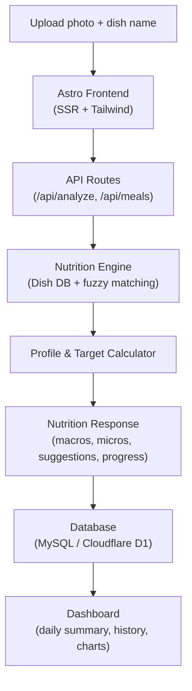

<picture>
  <source media="(prefers-color-scheme: dark)" srcSet="https://img.shields.io/badge/micro%26calorie%20tracker-171717?style=flat-square">
  
</picture>

<div align="center">
  <h1>Micro & Calorie Tracker</h1>
  <p><strong>AI-powered nutrition analysis · 30+ nutrients tracked · Smart meal scanning</strong></p>

  <a href="https://microcalorietracker.online">microcalorietracker.online</a>

  <br/><br/>

  <picture>
    <source media="(prefers-color-scheme: dark)" srcSet="https://img.shields.io/badge/node-%3E%3D22.12.0-339933?style=flat-square&logo=node.js&logoColor=white">
    
  </picture>
  
  
  
  
  
  

  <br/>
  <br/>

  <a href="#features">Features</a> ·
  <a href="#tech-stack">Tech Stack</a> ·
  <a href="#quick-start">Quick Start</a> ·
  <a href="#architecture">Architecture</a> ·
  <a href="#api">API</a> ·
  <a href="#project-structure">Project Structure</a> ·
  <a href="#database">Database</a> ·
  <a href="#security">Security</a> ·
  <a href="#roadmap">Roadmap</a>
</div>

---

**Micro & Calorie Tracker** is a full-featured, server-side rendered web application that uses AI-powered computer vision and a comprehensive nutrition database to analyze meals from photos. Track calories, protein, carbs, fats, fibre, and 13+ micronutrients — all without creating an account.

---

## Live Demo

Upload a photo or snap one with your camera to see instant nutrition breakdown — macros, micronutrients, personalised suggestions, and daily goal tracking. No account required.

[**→ microcalorietracker.online**](https://microcalorietracker.online)

## Screenshots

> Screenshots coming soon.

- **Home & Meal Scanner** — Upload zone, camera capture, dish name input, and weight adjustment.
- **Meal Analysis Results** — Nutrition report table, per-meal comparison, AI suggestions, and next meal ideas.
- **Dashboard** — Daily summary cards, macro donut chart, calorie history, meal timeline, and nutrition report.
- **Profile & Targets** — Personal details, goal settings, and daily target configuration.

## Features

- **Instant AI meal scanning** — Upload a photo or snap one with your camera. The AI identifies the dish and provides nutrition estimates within seconds.
- **30+ nutrients tracked** — Beyond calories: protein, carbs, fats, fibre, vitamins A–K, B12, folate, iron, calcium, zinc, magnesium, potassium, and more.
- **Personalised targets** — Based on your age, weight, goal (lose/maintain/gain), and activity level. Targets adapt per meal and per day.
- **Per-meal analysis** — Every scan shows how the meal stacks up against your target with colour-coded status badges.
- **AI suggestions** — Actionable feedback on each meal: too many carbs? Low on protein? Suggests next meals to fill nutritional gaps.
- **Daily dashboard** — Summary cards, macro donut chart, remaining targets, and a colour-coded nutrition report table.
- **Weekly history** — Bar chart of the last 7 or 30 days with average, goal, and streak tracking.
- **Weight goal tracking** — Set a target weight and track progress with ETA estimates.
- **Guest mode** — No sign-up required. All data persists in your browser and optionally syncs to the server.
- **User accounts** — Optional email-based accounts with session authentication for cross-device sync.
- **Dark mode** — Toggle between light and dark themes.
- **Responsive** — Works on mobile, tablet, and desktop.

## Why I Built This

Nutrition tracking shouldn't be tedious. Most apps require manual logging, barcode scanning, or tedious data entry — creating friction that makes consistency difficult. I wanted to build something that removes that friction entirely: upload a photo and get a complete nutritional picture in seconds.

This project also gave me the opportunity to work across the full stack — from AI-powered nutrition estimation and fuzzy dish matching, to server-side rendering with Astro, dual deployment targeting (Node.js + Cloudflare Workers), and database architecture across MySQL and D1. It's been a deep dive into modern TypeScript, responsive UI design, and production-grade deployment practices.

## Tech Stack

| Layer | Technology |
|-------|-----------|
| **Framework** | [Astro v7](https://astro.build) (server-side rendered) |
| **Styling** | [Tailwind CSS v4](https://tailwindcss.com) |
| **Database** | [MySQL 8](https://mysql.com) (Docker) / [Cloudflare D1](https://developers.cloudflare.com/d1/) (production) |
| **Cache** | Memcached (Docker) / [Cloudflare KV](https://developers.cloudflare.com/kv/) (production) |
| **Deployment** | [Node.js standalone](https://docs.astro.build/en/guides/integrations-guide/node/) (Docker) / [Cloudflare Workers](https://workers.cloudflare.com) |
| **Analytics** | Google Analytics 4 (optional) |
| **Icons** | SVG inline |

## Quick Start

### Prerequisites

- Node.js >= 22.12.0
- Docker and Docker Compose (for local MySQL + Memcached)

### Development

```sh
# Install dependencies
npm install

# Start the dev server
npm run dev
```

The development server starts at `http://localhost:4321`.

### Local MySQL + Memcached

```sh
docker compose up -d mysql memcached
```

Configure the connection via environment variables (see `.env.example`).

### Production Build

```sh
# Node.js standalone (Docker)
npm run build

# Cloudflare Workers
npm run build:cf
```

### Deploy to Cloudflare

```sh
npm run deploy
```

Builds the project with the Cloudflare adapter and deploys via `wrangler deploy`.

### Docker

```sh
docker compose up --build -d
```

Launches the full stack: the application, MySQL 8, and Memcached.

## Architecture

### Data Flow



### Dual Deployment Mode

The project supports two runtime environments:

- **Node.js (Docker):** Uses `@astrojs/node` adapter with MySQL + Memcached. Ideal for self-hosted deployments with Docker Compose.
- **Cloudflare Workers:** Uses `@astrojs/cloudflare` adapter with Cloudflare D1 and KV for serverless, edge-deployed production.

### Nutrition Engine

The built-in dish database (`src/pages/api/analyze.ts`) maps dish names to per-100g nutrition profiles. A fuzzy matching algorithm handles misspellings and partial names, falling back to a sensible default profile when no match is found. Micronutrients are estimated proportionally to portion size using standard reference values.

## API

All API routes are server endpoints under `src/pages/api/`.

| Endpoint | Method | Description |
|----------|--------|-------------|
| `/api/analyze` | POST | Analyze a meal (multipart form or JSON). Returns macros, micros, suggestions, and daily progress. |
| `/api/meals` | GET/POST | Retrieve or insert meal entries for the current user/guest. |
| `/api/daily` | GET | Get today's daily summary (targets, consumed, remaining, progress, meals). |
| `/api/history` | GET | Get daily summaries for the last N days (default: 7). |
| `/api/meal-targets` | GET | Get personalised per-meal and daily targets for the current user/guest. |
| `/api/profile` | GET/POST | Retrieve or update the user's profile (age, weight, goal, activity, etc.). |
| `/api/register` | POST | Create a new user account. |
| `/api/login` | POST | Authenticate and create a session. |
| `/api/logout` | POST | Destroy the current session. |
| `/api/guest` | POST | Create or update a guest session with personalised targets. |
| `/api/contact` | POST | Submit a contact form message. |

### Analyze Endpoint

**Request** (multipart/form-data or JSON):
```json
{
  "dishName": "Butter chicken",
  "weight": 350,
  "guestToken": "a1b2c3d4..."
}
```

**Response:**
```json
{
  "mealName": "Butter chicken",
  "weight": 350,
  "calories": 518,
  "macros": { "protein": 42, "carbs": 21, "fat": 32, "fiber": 3 },
  "micros": { "Vitamin A": { "val": 180, "unit": "µg", "ref": 800 }, ... },
  "suggestions": ["..."],
  "perMealTarget": { "calories": 667, "protein": 33, "carbs": 83, "fat": 22 },
  "dailyTarget": { "calories": 2000, "protein": 100, "carbs": 250, "fat": 65 },
  "consumed": { "calories": 518, ... },
  "remaining": { "calories": 1482, ... },
  "progress": { "calories": 26, ... }
}
```

## Project Structure

```
src/
├── components/
│   ├── Navbar.astro
│   └── Welcome.astro
├── layouts/
│   └── Layout.astro          # Global layout, SEO, dark mode, GA
├── lib/
│   ├── db.ts                 # Database layer (MySQL + D1 adapter)
│   ├── auth.ts               # Session management
│   ├── cache.ts              # Cache layer (Memcached + KV adapter)
│   ├── nutrition.ts          # BMR/TDEE calculation, target splitting
│   └── get-env.ts            # Cloudflare env helper
├── pages/
│   ├── index.astro           # Home — meal scanner & results
│   ├── dashboard.astro       # Daily dashboard, history, charts
│   ├── profile.astro         # User profile form
│   ├── about.astro
│   ├── privacy.astro
│   ├── terms.astro
│   ├── contact.astro
│   ├── 404.astro
│   ├── 500.astro
│   └── api/
│       ├── analyze.ts        # Meal analysis endpoint
│       ├── meals.ts          # Meal CRUD
│       ├── daily.ts          # Daily summary
│       ├── history.ts        # Weekly/history data
│       ├── meal-targets.ts   # Personalised targets
│       ├── profile.ts        # User profile
│       ├── register.ts
│       ├── login.ts
│       ├── logout.ts
│       ├── guest.ts          # Guest session management
│       └── contact.ts
└── styles/
    └── global.css

schema-d1.sql                 # Cloudflare D1 schema
init.sql                      # MySQL schema
migrate.sql                   # MySQL migrations
docker-compose.yml            # Full stack (app + MySQL + Memcached)
Dockerfile                    # Node.js standalone build
wrangler.jsonc                # Cloudflare Workers configuration
astro.config.mjs              # Node.js config
astro.config.cloudflare.mjs   # Cloudflare Workers config
```

## Database

### MySQL (local/Docker)

Schema is defined in `init.sql` and `migrate.sql`. The default database is `micros` with user `micros`.

### Cloudflare D1

Schema is defined in `schema-d1.sql`. Create the database with:

```sh
wrangler d1 create micros-db
wrangler d1 execute micros-db --file schema-d1.sql
```

### Environment Variables

| Variable | Default | Description |
|----------|---------|-------------|
| `DB_HOST` | `localhost` | MySQL host |
| `DB_PORT` | `3306` | MySQL port |
| `DB_USER` | `micros` | MySQL user |
| `DB_PASSWORD` | `micros_secret` | MySQL password |
| `DB_NAME` | `micros` | MySQL database |
| `MEMCACHED_HOST` | `localhost` | Memcached host |
| `MEMCACHED_PORT` | `11211` | Memcached port |
| `CACHE_TTL` | `3600` | Cache TTL in seconds |

## Security

- **Password hashing** — User credentials are hashed before storage.
- **Session cookies** — Authentication tokens use `httpOnly`, `secure`, and `sameSite` attributes.
- **Environment-based secrets** — Database passwords, API keys, and other sensitive values are loaded from environment variables, never hardcoded.
- **`.gitignore` hygiene** — Generated build output, node_modules, and temporary files are excluded from version control.
- **No credential exposure** — Take care never to commit `.env` files or secrets. Review diffs before pushing.

## Future Roadmap

Planned enhancements:

- [ ] **Barcode scanning** — Scan packaged food barcodes for instant nutrition lookup
- [ ] **OCR ingredient recognition** — Read nutrition labels from photos using optical character recognition
- [ ] **Improved food recognition** — Train on a larger, more diverse dataset for better dish identification across cuisines
- [ ] **Weekly nutrition reports** — Automated PDF/email summaries with trend analysis and gap insights
- [ ] **AI nutrition coaching** — Conversational recommendations based on your history, goals, and preferences
- [ ] **Mobile application** — Native iOS and Android apps with camera-first experience
- [ ] **Apple Health integration** — Sync meals, calories, and macros to Apple Health
- [ ] **Google Fit integration** — Cross-platform health data synchronisation

## Scripts

| Command | Description |
|---------|-------------|
| `npm run dev` | Start development server |
| `npm run build` | Build for Node.js standalone |
| `npm run build:cf` | Build for Cloudflare Workers |
| `npm run deploy` | Build + deploy to Cloudflare |
| `npm run preview` | Preview production build locally |
| `npm run astro` | Run any Astro CLI command |

## AI Limitations & Disclaimer

- **Estimates, not lab results** — All nutrition values are AI-assisted estimates based on visual analysis and a reference database. They are not a substitute for laboratory analysis.
- **Educational purposes** — This application is intended for informational and educational use. It is not a medical device and does not provide medical advice.
- **Consult a professional** — Always consult a qualified healthcare professional or registered dietitian before making significant changes to your diet or exercise routine.
- **Accuracy varies** — Results depend on photo quality, lighting, accurate weight input, and the dish being recognisable by the underlying database.

## Contributing

1. Fork the repository
2. Create a feature branch: `git checkout -b feat/my-feature`
3. Commit your changes: `git commit -am 'Add feature'`
4. Push to the branch: `git push origin feat/my-feature`
5. Open a pull request

## License

[MIT](LICENSE)

---

<div align="center">
  <p>
    <a href="https://microcalorietracker.online">microcalorietracker.online</a>
  </p>
</div>
